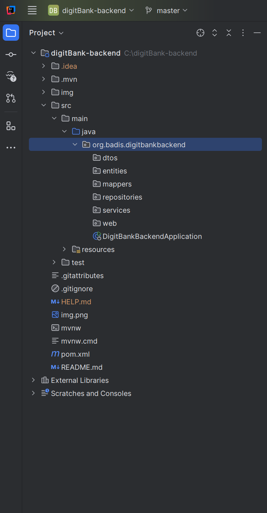
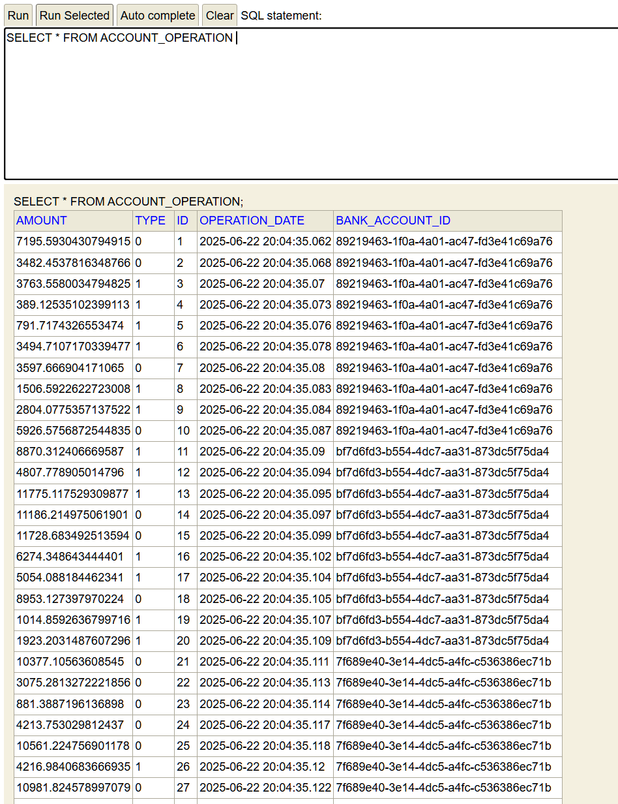

# Projet Spring Boot - Gestion de Comptes Bancaires

## 1. Créer un projet Spring Boot

## 2. Créer les entités JPA

- `Customer`
- `BankAccount`
- `SavingAccount`
- `CurrentAccount`
- `AccountOperation`

## 3. Créer les interfaces JPA Repository basées sur Spring Data

## 4. Tester la couche DAO

### Résultat des tests

- Test DAO général :

  

- Création d’un client (`Customer`) :

  

- Création d’un compte bancaire (`BankAccount`) :

  

- Création des operations d’un compte bancaire (`AccountOperation`) :

  